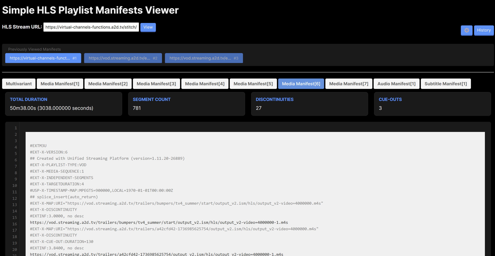

# Simple HLS Manifest Viewer 👀

Hello👋

This is a simple and basic browser-based tool for viewing and analyzing HLS (HTTP Live Streaming) playlist manifests. No installation required;

## What does it do? 🤔

This tool makes it super easy to inspect HLS stream manifests. Just paste your master manifest URL, and it will fetch and display:
- The master manifest
- All video variant playlists
- All audio playlists
- All subtitle/caption playlists

Each manifest is displayed in a separate tab with helpful metrics like:
- Total duration
- Segment count
- Number of discontinuities
- Number of ad breaks (cue-outs)
- Media sequence numbers
- Discontinuity sequence numbers

### Key Features ✨

- **No Installation Required**: Just open index.html in your browser
- **History**: Keep track of recently viewed manifests
- **Smart Selection**: Select segments to see their combined duration
- **Segment Preview**: Select segments to play them in a picture-in-picture style player
- **CORS Support**: Built-in CORS proxy support for accessing manifests from any source
- **Divergent Sequence Detection**: Highlights mismatched media/discontinuity sequences
- **Copy Support**: Easy URL copying and manifest content selection
- **Security**: Content Security Policy (CSP) enabled and HTML sanitization for safety

Instead of playing the stream in a video player and digging through browser network requests to find and inspect manifests, you can quickly view everything in one place. No more jumping between multiple network requests or manually calculating segment durations!

## Getting Started 🚀

1. Download or clone this repository
2. Open `index.html` in your web browser
3. Paste an HLS stream URL
4. Done! 🎉

That's it! No npm, no installation, no server required. All processing happens in your browser.

## Using the Segment Player 🎬

1. Select segments in any media manifest by highlighting them
2. A floating player will appear showing the selected segments
3. The player supports both TS and fMP4/CMAF segments
4. Clear the selection to stop playback

Note: The selection must include the segment's EXTINF line for proper playback

## Browser Support 🌐

Works in all modern browsers that support ES6+ JavaScript:
- Chrome
- Firefox
- Safari
- Edge
(Must support HLS.js for segment preview feature)

## Contributing 🤝

Feel free to open issues or submit pull requests if you have suggestions for improvements!

## Security 🔒

- Content Security Policy (CSP) enabled
- All user input is sanitized
- No server-side processing required
- All code runs locally in your browser
